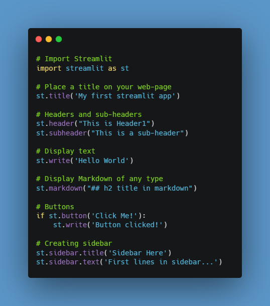

import os
import re
import shutil
import sqlite3
from pathlib import Path

def modificar_name_pasta(name):
    """
    Remove padrões específicos do nome do arquivo.
    """
    padroes_a_remover = [
        r'^mtd0[3]_', r'^mtd0[4]_', r'^\d+_',
        # Adicione outros padrões conforme necessário
    ]

    for padrao in padroes_a_remover:
        name = re.sub(padrao, '', name)
    return name

def normalizar_caminho(caminho):
    """
    Substitui barras invertidas por barras normais nos caminhos.
    """
    return str(caminho).replace("\\", "/")

def percorrer_diretorio(caminho, conexao_banco):
    """
    Percorre o diretório e insere dados na tabela Rota.
    """
    if os.path.exists(caminho):
        for root, dirs, files in os.walk(caminho):
            for arquivo_ou_diretorio in files:
                caminho_completo = Path(root) / arquivo_ou_diretorio
                extensao = caminho_completo.suffix.lower()

                if extensao in [".shp", ".cpg", ".dbf", ".prj", ".sbn", ".sbx", ".shx"]:
                    print(f"Arquivo: {caminho_completo}")

                    name = caminho_completo.stem
                    pasta = modificar_name_pasta(name)
                    destino = Path(".", pasta, caminho_completo.name)

                    destino.parent.mkdir(parents=True, exist_ok=True)
                    shutil.copy(caminho_completo, destino)

                    origem = normalizar_caminho(caminho_completo)
                    destino = normalizar_caminho(destino)

                    # Adicionar expressão regular para remover parte específica da origem
                    origem_sem_parte_especifica = re.sub(r'^//nas\.ibge\.gov\.br/DGC-ACERVO-CCAR2/CONVERSAO_DIGITAL/CCAR_PRODUTOS_VETOR/Arquivos_Shape/CCAR_PRODUTOS_VETOR/', '', origem)

                    inserir_dados_rota(conexao_banco, name, origem_sem_parte_especifica, destino)

def criar_tabela_rota(conexao):
    cursor = conexao.cursor()
    cursor.execute('''
        CREATE TABLE IF NOT EXISTS Rota (
            id INTEGER PRIMARY KEY AUTOINCREMENT,
            name TEXT,
            origem TEXT,
            destino TEXT
        )
    ''')
    conexao.commit()

def inserir_dados_rota(conexao, name, origem, destino):
    cursor = conexao.cursor()
    cursor.execute('''
        INSERT INTO Rota (name, origem, destino) VALUES (?, ?, ?)
    ''', (name, origem, destino))
    conexao.commit()

# Substituir o caminho do banco de dados conforme necessário
caminho_banco = 'dbSql.sqlite'

# Substituir "C:\caminho\para\arquivos" pelo caminho real dos arquivos shapefile
caminho = r'\\nas.ibge.gov.br\DGC-ACERVO-CCAR2\CONVERSAO_DIGITAL\CCAR_PRODUTOS_VETOR\Arquivos_Shape\CCAR_PRODUTOS_VETOR'

# Conectar ao banco de dados
conexao_banco = sqlite3.connect(caminho_banco)

# Criar a tabela Rota se ainda não existir
criar_tabela_rota(conexao_banco)

# Percorrer o diretório e inserir os dados na tabela Rota
percorrer_diretorio(caminho, conexao_banco)

# Fechar a conexão com o banco de dados
conexao_banco.close()


<h1 align="center">
             • ⭐ Marmitex
</h1>


## Rationale  []()

Streamlit doesn't support running under HTTPS, but you might want to do that. One way to achieve this is to use a reverse proxy, and enable HTTPS on the proxy server. The user's browser connects to the proxy over HTTPS. The proxy server terminates the HTTPS connection and forwards requests over HTTP to Streamlit. Responses from Streamlit go via the proxy, back to the user.

```
┌────────────┐           ┌─────────┐           ┌─────────────┐
│            │──────────▶│         │──────────▶│             │
│  Browser   │   HTTPS   │  Proxy  │   HTTP    │  Streamlit  │
│            │◀ ─ ─ ─ ─ ─│         │◀ ─ ─ ─ ─ ─│             │
└────────────┘           └─────────┘           └─────────────┘


 ──────────▶  Request

 ◀ ─ ─ ─ ─ ─  Response
 ```


## Tech Stacks Used


## Libraries Used

   


## Prerequisites

- Python 3.6.X
- Pandas
- Numpy
- Plotly
- Matplotlib
- Streamlit
- Docker
- Docker Compose
- openpyxl
- Deta

> ***```Deta```***: Utilizado como uma solução de banco de dados e armazenamento na nuvem, fornecendo recursos de persistência de dados para o seu web app.

>  ***```Matplotlib```***: Uma biblioteca de visualização de dados em Python, utilizada para criar gráficos e visualizações.

> ***```Numpy```***: Uma biblioteca Python utilizada para trabalhar com arrays. É uma biblioteca Python central para a computação científica.

> ***```Pandas```***: Uma biblioteca Python utilizada para trabalhar com dados. Ela tem funções que tornam o trabalho com dados mais fácil.

> ***```Plotly```***: Uma biblioteca Python utilizada para criar visualizações interativas.

> ***```Streamlit```***: Uma biblioteca de criação de aplicativos da web para visualização interativa de dados, que permite criar interfaces de usuário interativas para explorar e apresentar dados.


## Model Deployment

- The web application is built using a python library -> Streamlit
- The entire application is finally deployed on Streamlit CLoud Share Platform
- See the deployed application [here](https://kozuki-oden-dataviz-app-o8biva.streamlit.app/)


## Basics of Streamlit
#### What is Streamlit?<br>
<i>Streamlit</i> is an open source web framework that lets you build webpages using only Python :snake:. Thereby, removing the need for developers to use HTML, CSS and Js. It uses what is called as widgets/components to construct your website.<br><br>
<b><ins>Developer Trivia</ins>:</b> Streamlit components are essentially Python wrappers of React code (Judges, extra points :grin:?).

#### Installing streamlit
~~~
pip install streamlit
~~~

#### Write some streamlit code


#### Running streamlit files<br>
Let us assume our file name to be 'streamlit_basics.py' and that we are in the correct directory.
~~~
streamlit run streamlit_basics.py
~~~


## Installation

Clone this repository :

	git clone https://github.com/estevam5s/big-data-drisssen
	cd big-data-drisssen
	
You may want to use a virtual environment to keep a clean Python installation :

	python3 -m venv myenv/
	source myenv/bin/activate


## Frontend Using Streamlit

<p align="center">
  
</p>


## Step -1 Install the requirements

```
pip install -r requirements.txt
```

## Step -2 Run the app.py

```
streamlit run app.py --server.address 0.0.0.0 --server.port 8080
```

# Dockerized Streamlit App

> Prototyping a user interface with Streamlit

Sometimes we need to resolve very quickly a delivery or we have to validate a protopyte.

The objective of this project is to provide an interface that allows to a person (who don`t handle Conda or Jupyter Notebook) select an xls, process its content and obtain the result needed.

Here we go!

## Run the app

The first time the project is used, the following commands should be run:

1. Build container:
   `docker build -f docker/Dockerfile -t streamlitapp:latest .`

2. Run container:
   `docker run -d -p 8501:8501 streamlitapp:latest`

3. You can now view your Streamlit app in your browser http://localhost:8501

4. Browse to upload the xls file and select the example file located ./example/

5. Download the new file generated width the transform

6. To shut down container:
   `docker ps`
   `docker stop CONTAINER_ID`


## Deploying to Heroku

First, [install heroku and login](https://devcenter.heroku.com/articles/getting-started-with-python#set-up). 
To create a new deployment, run inside `traingenerator`:

```
heroku create
git push heroku main
heroku open
```

To update the deployed app, commit your changes and run:

```
git push heroku main
```

*Optional: If you set up a Github repo to enable the "Open in Colab" button (see above),
you also need to run:*

```
heroku config:set GITHUB_TOKEN=<your-github-access-token>
heroku config:set REPO_NAME=<user/notebooks-repo>
```


## Built With

- [Numpy](https://numpy.org/) - Fundamental package for scientific computing with Python,
- [Pandas](https://pandas.pydata.org/) - Library providing data structures and data analysis tools for Python,
- [Streamlit](https://streamlit.io) - Open-source app framework,

## Dependencies

All the Python packages needed are listed in [requirements.txt](https://github.com/romaincaraes/bond-valuation-python/blob/master/requirements.txt) and on the [Dependency Graph page](https://github.com/romaincaraes/bond-valuation-python/network/dependencies).


<!-- USAGE EXAMPLES -->
## Examples

amazing examples by Streamlit https://streamlit.io/gallery

_For more, please refer to the [Documentation](https://docs.streamlit.io/en/stable/)_

<!-- CONTRIBUTING -->
## Contributing

Contributions are what make the open source community such an amazing place to learn, inspire, and create. Any contributions you make are **greatly appreciated**.

1. Fork the Project
2. Create your Feature Branch (`git checkout -b feature/AmazingFeature`)
3. Commit your Changes (`git commit -m 'Add some AmazingFeature'`)
4. Push to the Branch (`git push origin feature/AmazingFeature`)
5. Open a Pull Request


## License

This project is licensed under the [MIT License](https://github.com/romaincaraes/bond-valuation-python/blob/master/LICENSE).

## Authors


